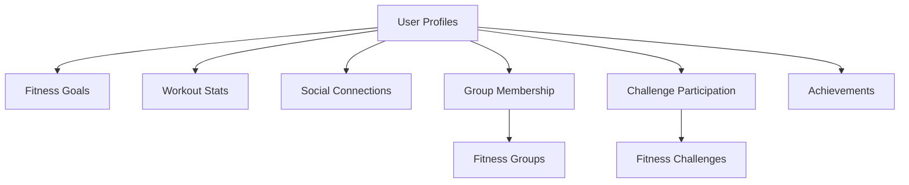

# FitGrid Social Fitness

A blockchain-based social fitness platform that connects users with similar fitness goals, enables progress tracking, and rewards achievements through smart contracts.

## Overview

FitGrid is a decentralized platform that combines fitness tracking with social networking features. Built on the Stacks blockchain, it allows users to:

- Create fitness profiles and set personal goals
- Track workout progress and stats
- Connect with like-minded fitness enthusiasts
- Join fitness groups and participate in challenges
- Earn verifiable achievements and rewards

The platform leverages blockchain technology to ensure transparent tracking of achievements and fair distribution of incentives while building a community of fitness-focused individuals.

## Architecture

The platform is built around a core smart contract that manages:



## Contract Documentation

### FitGrid Core Contract

The main contract (`fitgrid-core`) manages all platform functionality:

#### Key Features:
- User profile management
- Fitness goal tracking
- Social connections
- Group management
- Challenge system
- Achievement tracking

#### Data Models:
- Users
- Fitness Goals
- Fitness Stats
- Workout Preferences
- Social Connections
- Groups
- Challenges
- Achievements

## Getting Started

### Prerequisites
- Clarinet installed
- Stacks wallet for deployment/interaction

### Installation

1. Clone the repository
2. Install dependencies
```bash
clarinet install
```

### Basic Usage

1. Register a user:
```clarity
(contract-call? .fitgrid-core register-user "username" "bio" u5 true)
```

2. Set fitness goals:
```clarity
(contract-call? .fitgrid-core set-fitness-goals (some u150) (some u150) (some u3) (some u144000))
```

3. Join a fitness group:
```clarity
(contract-call? .fitgrid-core join-fitness-group u1)
```

## Function Reference

### User Management

#### register-user
```clarity
(define-public (register-user (username (string-utf8 50)) (bio (string-utf8 500)) (fitness-level uint) (is-public bool)))
```
Creates a new user profile.

#### update-user-profile
```clarity
(define-public (update-user-profile (username (string-utf8 50)) (bio (string-utf8 500)) (fitness-level uint) (is-public bool)))
```
Updates existing user profile information.

### Fitness Tracking

#### set-fitness-goals
```clarity
(define-public (set-fitness-goals (weight-goal (optional uint)) (cardio-goal-minutes (optional uint)) (strength-goal-sessions (optional uint)) (target-date (optional uint))))
```
Sets or updates user fitness goals.

#### update-fitness-stats
```clarity
(define-public (update-fitness-stats (current-weight (optional uint)) (weekly-cardio-minutes uint) (weekly-strength-sessions uint) (workout-completed bool)))
```
Updates user's fitness statistics.

### Social Features

#### request-connection
```clarity
(define-public (request-connection (connection-user principal)))
```
Sends a connection request to another user.

#### accept-connection
```clarity
(define-public (accept-connection (requestor principal)))
```
Accepts a pending connection request.

### Groups and Challenges

#### create-fitness-group
```clarity
(define-public (create-fitness-group (name (string-utf8 50)) (description (string-utf8 500)) (max-members uint) (focus-area (string-utf8 30)) (is-public bool)))
```
Creates a new fitness group.

#### create-fitness-challenge
```clarity
(define-public (create-fitness-challenge (name (string-utf8 50)) (description (string-utf8 500)) (start-date uint) (end-date uint) (challenge-type (string-utf8 30)) (target-value uint) (reward-points uint)))
```
Creates a new fitness challenge.

## Development

### Testing

Run the test suite:
```bash
clarinet test
```

### Local Development
1. Start local devnet:
```bash
clarinet devnet start
```

2. Deploy contracts:
```bash
clarinet deploy
```

## Security Considerations

### Access Control
- User profile updates restricted to profile owner
- Group management limited to group admins
- Challenge updates restricted to participants

### Data Validation
- Input validation for all public functions
- Proper error handling for invalid operations
- Timestamp checks for challenge participation

### Limitations
- Challenge progress updates rely on honest reporting
- Social connections require manual verification
- Group sizes limited to prevent scaling issues

# Zikodric/FitGrid_Social_Fitness
# contracts/fitgrid-core.clar
;; fitgrid-core
;; This contract serves as the central hub for the FitGrid platform, handling 
;; user registries, profile management, fitness goal tracking, and social connections.
;; Users can create profiles, set fitness goals, track progress, connect with others,
;; join groups, and participate in challenges to earn rewards.

;; Error codes
(define-constant ERR-NOT-AUTHORIZED (err u100))
(define-constant ERR-USER-ALREADY-EXISTS (err u101))
(define-constant ERR-USER-NOT-FOUND (err u102))
(define-constant ERR-CONNECTION-ALREADY-EXISTS (err u103))
(define-constant ERR-CONNECTION-NOT-FOUND (err u104))
(define-constant ERR-GROUP-NOT-FOUND (err u105))
(define-constant ERR-ALREADY-GROUP-MEMBER (err u106))
(define-constant ERR-NOT-GROUP-MEMBER (err u107))
(define-constant ERR-CHALLENGE-NOT-FOUND (err u108))
(define-constant ERR-ALREADY-JOINED-CHALLENGE (err u109))
(define-constant ERR-MILESTONE-INVALID (err u110))
(define-constant ERR-CHALLENGE-ENDED (err u111))
(define-constant ERR-INVALID-PARAMETER (err u112))

;; Data structures

;; User profile data
(define-map users 
  { user: principal }
  {
    username: (string-utf8 50),
    bio: (string-utf8 500),
    created-at: uint,
    fitness-level: uint,
    is-public: bool
  }
)

;; User fitness goals
(define-map fitness-goals
  { user: principal }
  {
    weight-goal: (optional uint),
    cardio-goal-minutes: (optional uint),
    strength-goal-sessions: (optional uint),
    target-date: (optional uint),
    created-at: uint,
    last-updated: uint
  }
)

;; User current stats
(define-map fitness-stats
  { user: principal }
  {
    current-weight: (optional uint),
    weekly-cardio-minutes: uint,
    weekly-strength-sessions: uint,
    total-workouts: uint,
    last-updated: uint
  }
)

;; User workout preferences
(define-map workout-preferences
  { user: principal }
  {
    preferred-activities: (list 10 (string-utf8 30)),
    preferred-intensity: uint,
    preferred-duration: uint,
    preferred-time: (string-utf8 20)
  }
)

;; User connections (social graph)
(define-map connections
  { user: principal, connection: principal }
  {
    status: (string-utf8 20), ;; "pending", "connected", "blocked"
    connected-at: uint
  }
)

;; Fitness groups
(define-map fitness-groups
  { group-id: uint }
  {
    name: (string-utf8 50),
    description: (string-utf8 500),
    creator: principal,
    created-at: uint,
    max-members: uint,
    focus-area: (string-utf8 30),
    is-public: bool
  }
)

;; Group membership
(define-map group-members
  { group-id: uint, user: principal }
  {
    joined-at: uint,
    role: (string-utf8 20) ;; "member", "admin"
  }
)

;; Fitness challenges
(define-map fitness-challenges
  { challenge-id: uint }
  {
    name: (string-utf8 50),
    description: (string-utf8 500),
    creator: principal,
    start-date: uint,
    end-date: uint,
    challenge-type: (string-utf8 30),
    target-value: uint,
    reward-points: uint,
    is-active: bool
  }
)

;; Challenge participation
(define-map challenge-participants
  { challenge-id: uint, user: principal }
  {
    joined-at: uint,
    current-progress: uint,
    completed: bool,
    completed-at: (optional uint)
  }
)

;; Achievements and rewards
(define-map user-achievements
  { user: principal, achievement-id: uint }
  {
    name: (string-utf8 50),
    description: (string-utf8 500),
    earned-at: uint,
    points: uint
  }
)

;; Counter for group IDs
(define-data-var next-group-id uint u1)

;; Counter for challenge IDs
(define-data-var next-challenge-id uint u1)

;; Counter for achievement IDs
(define-data-var next-achievement-id uint u1)

;; Private functions

;; Helper to get current block height as timestamp
(define-private (get-current-time)
  block-height
)

;; Check if a user exists
(define-private (user-exists (user principal))
  (is-some (map-get? users {user: user}))
)

;; Check if connection exists between two users
(define-private (connection-exists (user-1 principal) (user-2 principal))
  (is-some (map-get? connections {user: user-1, connection: user-2}))
)

;; Check if user is authorized
(define-private (is-self-or-contract-owner (user principal))
  (or
    (is-eq tx-sender user)
    (is-eq tx-sender (contract-owner))
  )
)

;; Check if user is in group
(define-private (is-group-member (group-id uint) (user principal))
  (is-some (map-get? group-members {group-id: group-id, user: user}))
)

;; Check if user has joined a challenge
(define-private (has-joined-challenge (challenge-id uint) (user principal))
  (is-some (map-get? challenge-participants {challenge-id: challenge-id, user: user}))
)

;; Calculate achievement based on fitness metrics
(define-private (check-achievement-milestone (user principal))
  (let (
    (stats (unwrap! (map-get? fitness-stats {user: user}) false))
    (goals (unwrap! (map-get? fitness-goals {user: user}) false))
  )
    (if (and (> (get total-workouts stats) u50) (is-some (get weight-goal goals)))
      (grant-achievement user "50 Workouts Completed" "Completed 50 workout sessions" u50)
      false
    )
  )
)

;; Grant achievement to user
(define-private (grant-achievement (user principal) (name (string-utf8 50)) (description (string-utf8 500)) (points uint))
  (let (
    (achievement-id (var-get next-achievement-id))
  )
    (map-set user-achievements 
      {user: user, achievement-id: achievement-id}
      {
        name: name,
        description: description,
        earned-at: (get-current-time),
        points: points
      }
    )
    (var-set next-achievement-id (+ achievement-id u1))
    true
  )
)

;; Read-only functions

;; Get user profile
(define-read-only (get-user-profile (user principal))
  (map-get? users {user: user})
)

;; Get user fitness goals
(define-read-only (get-fitness-goals (user principal))
  (map-get? fitness-goals {user: user})
)

;; Get user fitness stats
(define-read-only (get-fitness-stats (user principal))
  (map-get? fitness-stats {user: user})
)

;; Get user workout preferences
(define-read-only (get-workout-preferences (user principal))
  (map-get? workout-preferences {user: user})
)

;; Check if two users are connected
(define-read-only (are-users-connected (user-1 principal) (user-2 principal))
  (and
    (is-some (map-get? connections {user: user-1, connection: user-2}))
    (is-eq (get status (default-to {status: "", connected-at: u0} 
      (map-get? connections {user: user-1, connection: user-2}))) "connected")
  )
)

;; Get group details
(define-read-only (get-group-details (group-id uint))
  (map-get? fitness-groups {group-id: group-id})
)

;; Get challenge details
(define-read-only (get-challenge-details (challenge-id uint))
  (map-get? fitness-challenges {challenge-id: challenge-id})
)

;; Get user achievements
(define-read-only (get-user-achievements (user principal))
  (map-get? user-achievements {user: user, achievement-id: u0})
)

;; Check if challenge is active
(define-read-only (is-challenge-active (challenge-id uint))
  (let (
    (challenge (map-get? fitness-challenges {challenge-id: challenge-id}))
  )
    (and 
      (is-some challenge) 
      (get is-active (default-to {is-active: false} challenge))
    )
  )
)

;; Public functions

;; Register new user
(define-public (register-user (username (string-utf8 50)) (bio (string-utf8 500)) (fitness-level uint) (is-public bool))
  (let (
    (user tx-sender)
    (current-time (get-current-time))
  )
    (asserts! (not (user-exists user)) ERR-USER-ALREADY-EXISTS)
    (asserts! (> (len username) u0) ERR-INVALID-PARAMETER)
    (asserts! (<= fitness-level u10) ERR-INVALID-PARAMETER)

    ;; Create user profile
    (map-set users 
      {user: user}
      {
        username: username,
        bio: bio,
        created-at: current-time,
        fitness-level: fitness-level,
        is-public: is-public
      }
    )

    ;; Initialize fitness goals (empty)
    (map-set fitness-goals
      {user: user}
      {
        weight-goal: none,
        cardio-goal-minutes: none,
        strength-goal-sessions: none,
        target-date: none,
        created-at: current-time,
        last-updated: current-time
      }
    )

    ;; Initialize fitness stats (empty)
    (map-set fitness-stats
      {user: user}
      {
        current-weight: none,
        weekly-cardio-minutes: u0,
        weekly-strength-sessions: u0,
        total-workouts: u0,
        last-updated: current-time
      }
    )

    ;; Initialize workout preferences (empty)
    (map-set workout-preferences
      {user: user}
      {
        preferred-activities: (list),
        preferred-intensity: